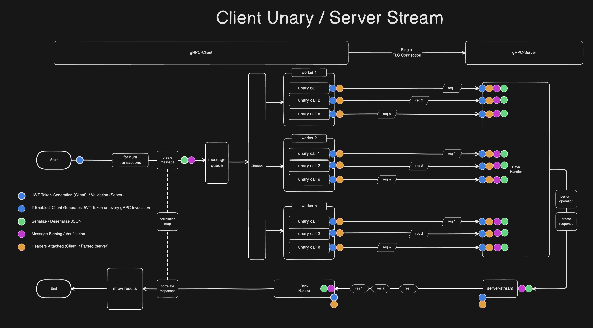
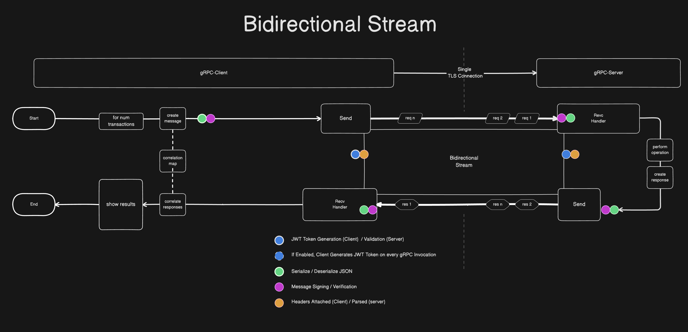

# Client-Unary/Server-Stream vs Binary Stream - gRPC Study
This study aims to compare the use of a client-unary/server-stream vs a binary, client/server stream using gRPC.  
## Simulated Overhead
To simulate some real-world use-cases, the client and server will perform a significant amount of overhead to facilitate communication. They are listed as follows:
- **TLS with Client Auth**: The client and server will establish a single TLS connection, which will be re-used for every gRPC invocation.
- **JWT Authentication**: The client will send a JWT Token to be validated by the server.  This overhead can be adjusted in the following ways:
  - **Once**: The client will generate a single JWT token, and use it for every rpc invocation. (less overhead, default)
  - **Every**: The client will generate a new JWT token to be used for every new rpc invocation. (more overhead)
- **Cryptographic Message Signing**: Each message sent by the client and server will be signed. Each message received by the client/server will be verified.
- **Serializing/Deserializing**: Each message being sent is JSON serialized into `[]byte` to be deserialized by the other side.
- **Number Crunching**: The gRPC service being implemented is a simple calculator with two functions, they are: add two numbers together (easy), or determine if the first number provided in the message is a prime (scalable difficulty). You can make the server work harder or easier by providing it a bigger number to determine a `isPrime` result.
- **Headers**: Attaching some gRPC metdata to each gRPC invocation.

## Description of RPCs
The Service implemented is as follows
```protobuf
syntax = "proto3";

option go_package = "grpc-benchmark-study/calculator";

package calculator;

import "google/protobuf/empty.proto";

message CalcMessage {
  bytes payload = 1;
}

service CalculatorService {
  rpc performCalculationBi (stream CalcMessage) returns (stream CalcMessage);
  rpc performCalculationTo (CalcMessage) returns (google.protobuf.Empty);
  rpc performCalculationFrom (google.protobuf.Empty) returns (stream CalcMessage);
}

```
and each `CalcMessage` represents a `[]byte` serialized representation of the following struct
```go
type Calculation struct {
	ID        int32  `json:"id"`
	X         int    `json:"x"`
	Y         int    `json:"y"`
	Operation string `json:"operation"`
	Result    int    `json:"result"`
	Prime     bool   `json:"isPrime"`
}
```
### Comparison of RPCs
**Client Unary/Server Stream**
```protobuf
  rpc performCalculationTo (CalcMessage) returns (google.protobuf.Empty);
  rpc performCalculationFrom (google.protobuf.Empty) returns (stream CalcMessage);
```
The client will send one or more requests concurrently to the server via the `rpc performCalculationTo`. All responses, will be returned eventually by the server via the `rpc performCalculationFrom`.

There are a few advantages to this setup.  They are as follows:
- The client can take advantage of gRPC load-balancing features using plugins such as xDS.  As each invocation would potentially be balanced to a different gRPC endpoint, a noisy client using a bidirectional stream would not potentially overload a single endpoint.
- Unary requests can be scaled up or down using worker routines to increase send rate to the server.  This could potentially account for any disadvantages, listed below.
- The client can subscribe to response messages on a separate stream. Response 

There are a few disadvantages to this method. They are as follows:
- Each invocation of an RPC requires the following overhead
  - Generating a new JWT token (if setup to generate on each invocation), validating each 
  - Setup and Teardown of HTTP/2 stream (even unary is an underlying HTTP/2 stream)
  - Attaching and parsing of headers/metadata on each rpc invocation.

**Binary Client/Server Stream**
```protobuf
  rpc performCalculationBi (stream CalcMessage) returns (stream CalcMessage);
```
The client will establish a single bidirectional stream to the server and send messages through it to the server.  The server will send responses back on the stream, similar to the server stream of the unary method.

There are a few advantages to this setup. They are as follows:
- HTTP/2 stream is established once.
- JWT token creation/validating occurs once.
- Attached headers/parsing headers occurs once.

The disadvantages of this setup are as follows:
- bidirectional streams cannot be effectively load-balanced. Because each RPC is load-balanced, and not message. A single stream between a client and a server could potentially overload a single-node.  The load-balanced with current out-of-the-box solutions.
- Client is limited to a single HTTP/2 stream for requests. With unary, we can scale up workers to make concurrent unary requests.  Creating multiple bidirectional streams could add additional complexity. 

## Client Server Implementation Overview
### Unary
For the Client Unary / Server Stream implementation, the client generates messages which are then fed into a `go channel`. Each worker receives messages on the channel and executes Unary RPC calls to send the messages to the server.

The client will then receive and correlate responses sent back from the server on the Server Stream RPC.

### Bidirectional
This implementation is much more straight-forward.  The client will generate messages as fast is it can and send them on the bidirectional stream.  It will also concurrently handle responses sent back from the server on the same stream and correlate the responses.



## Test Environment
These tests were run on two Google Cloud compute VMS, specifically:
```bash
MACHINE_TYPE="e2-medium"                # Machine type.
IMAGE_FAMILY="debian-11"                # OS image family.
```
The client was deployed on the `grpc-client` VM, while the server was deployed on the `grpc-server` VM.  

NOTE: These VMs are effectively in the same subnet. Network overhead is not a part of this test.


### Setup
If you'd like to run the tests yourself, you'll need a Google Cloud project and the gcloud CLI installed on your system. Once that is done, edit the `scripts/gcloud-ctl.sh` script to change the top-level variables to suit your Google Cloud project, VM types, etc.

You can then create and destroy the test environment using the following commands.
```bash
scripts/gcloud-ctl.sh create
scripts/gcloud-ctl.sh destroy
```

The `create` arg on the `gcloud-ctl.sh` script will print you out some `ssh` commands you can use to log into the VMs. I like to have a terminal for the client and the server.  

**Starting the gRPC Server**
Once you're in the server VM, you can start the server by running `$ ./server`
```bash
anthony@grpc-server:~$ ./server 
2025/02/15 03:24:36 Server listening on 0.0.0.0:50051
```

### Running Tests
Once you're on the client VM, you can begin running some tests. Here's a simple one, let's run through it. (Your Host IP will be different! This is the grpc-server's internal IP.)

**Example Test**
```bash
./client -host=10.128.0.2:50051 -mode=bidirectional -interval=1 -transactions=1000 -client-id=myClient -x 3 -y 1 -operation=isprime -latency-gt=10 -jwt-gen=once
```
- `-mode=bidirectional`: This test will run using the binary client/server RPCs. Single binary stream, with the client and server both sending and receiving concurrently.
- `interval=1`: The client will send a request on the stream every 1ms.
- `-transactions=1000`: Run the test until 1000 messages have been sent by the client, wait a little for responses.
- `-client-id=myClient`: This gets attached as a metadata gRPC header, used by server to uniquely identify clients and response streams.
- `-x 3 -y 1 -operation=isprime`: What two numbers, and operations are being fed to the calculator.  `isPrime` will only determine if `x` is prime or not. 
- `-latency-gt=10`: When the summary is printed, only show responses where the round-trip was greater than the int specified. This value is `milliseconds`.
- `jwt-gen=once`: Only generate a JWT token once, use on every gRPC invocation, more important for `unary` mode.

**Example Results**
```bash
anthony@grpc-client:~$ ./client -host=10.128.0.2:50051 -mode=bidirectional -interval=1 -transactions=1000 -client-id=myClient -x 3 -y 1 -operation=isprime -latency-gt=5 -jwt-gen=once
2025/02/15 03:31:46 Generated JWT token (once mode)
2025/02/15 03:31:46 Running in bidirectional mode with client-id=myClient, interval=1ms, total transactions=1000
2025/02/15 03:31:46 Sent bidirectional message 0
2025/02/15 03:31:46 Sent bidirectional message 1
2025/02/15 03:31:46 Received response for ID=0, Latency=6ms, Response: id=0, x=3, y=1, operation=isprime, result=0, isPrime=true
2025/02/15 03:31:46 Sent bidirectional message 2
2025/02/15 03:31:46 Received response for ID=1, Latency=5ms, Response: id=1, x=3, y=1, operation=isprime, result=0, isPrime=true
2025/02/15 03:31:46 Sent bidirectional message 3
...
2025/02/15 03:31:49 Bidirectional receive error: rpc error: code = Unknown desc = EOF
2025/02/15 03:31:49 All transactions sent. Waiting for pending responses...
2025/02/15 03:31:51 ==== SUMMARY ====
2025/02/15 03:31:51 Duration: 4.87s
2025/02/15 03:31:51 Average Request TPS: 347.00, Max Request TPS: 355
2025/02/15 03:31:51 Average Response TPS: 346.50, Max Response TPS: 355
2025/02/15 03:31:51 Tracking summary (only entries with latency > 5ms):
2025/02/15 03:31:51 ID=701, Sent=id=701, x=3, y=1, operation=isprime, result=0, isPrime=false, Response=id=701, x=3, y=1, operation=isprime, result=0, isPrime=true, Received=true, Latency=8ms
2025/02/15 03:31:51 ID=132, Sent=id=132, x=3, y=1, operation=isprime, result=0, isPrime=false, Response=id=132, x=3, y=1, operation=isprime, result=0, isPrime=true, Received=true, Latency=6ms
2025/02/15 03:31:51 ID=968, Sent=id=968, x=3, y=1, operation=isprime, result=0, isPrime=false, Response=id=968, x=3, y=1, operation=isprime, result=0, isPrime=true, Received=true, Latency=6ms
2025/02/15 03:31:51 ID=21, Sent=id=21, x=3, y=1, operation=isprime, result=0, isPrime=false, Response=id=21, x=3, y=1, operation=isprime, result=0, isPrime=true, Received=true, Latency=6ms
...
2025/02/15 03:31:51 ID=0, Sent=id=0, x=3, y=1, operation=isprime, result=0, isPrime=false, Response=id=0, x=3, y=1, operation=isprime, result=0, isPrime=true, Received=true, Latency=6ms
2025/02/15 03:31:51 ID=39, Sent=id=39, x=3, y=1, operation=isprime, result=0, isPrime=false, Response=id=39, x=3, y=1, operation=isprime, result=0, isPrime=true, Received=true, Latency=6ms
2025/02/15 03:31:51 ID=88, Sent=id=88, x=3, y=1, operation=isprime, result=0, isPrime=false, Response=id=88, x=3, y=1, operation=isprime, result=0, isPrime=true, Received=true, Latency=6ms
```

### Reading Results
When a client is done sending a gRPC `EOF` error is returned, which will close down the stream.  
```bash
2025/02/15 03:31:49 Bidirectional receive error: rpc error: code = Unknown desc = EOF
```
Next you can see how long the test ran for, in addition to average TPS, and max TPS for requests and responses.
```bash
2025/02/15 03:31:51 Duration: 4.87s
2025/02/15 03:31:51 Average Request TPS: 347.00, Max Request TPS: 355
2025/02/15 03:31:51 Average Response TPS: 346.50, Max Response TPS: 355
```

Lastly, all requests and corresponding responses are tracked and displayed at the end.  Adding the `-latency-gt=<INT>` is a good way to only care about round trips greater than a specified threshold. 

## Findings
Based on the test results, the optimal configuration appears to be using unary mode with moderate concurrency and generating a single JWT token for the entire test (JWT once). For example, with 3 workers, the system achieved an average request TPS of about 404 while maintaining an average latency of around 6 ms. Although bidirectional mode yielded slightly lower TPS and lower latency in some cases, the increased scalability and overall throughput in the unary configuration with 3 workers provided the best balance between performance and latency. Additionally, generating a new JWT for every invocation introduced overhead that further reduced TPS, making the "once" approach more efficient for high-throughput benchmarks.

Peak CPU usage spiked to ~28% during the 10 Worker Tests for the Server and about 40% for the client. Remaining usage hovered around 10%-20%.  CPU usage was determined by CPU charts in Google cloud.

| Test                              | Mode          | Workers | JWT Mode | Duration (s) | Total Entries | Received | Avg Req TPS | Max Req TPS | Avg Resp TPS | Max Resp TPS | Avg Latency (ms) | Median (ms) | 90th (ms) | 95th (ms) | Min (ms) | Max (ms) | StdDev (ms) |
|-----------------------------------|---------------|---------|----------|--------------|---------------|----------|-------------|-------------|--------------|--------------|------------------|-------------|-----------|-----------|----------|----------|-------------|
| Bidirectional                     | Bidirectional | N/A     | once     | 16.87        | 5000          | 5000     | 336.14      | 344         | 336.07       | 344          | 4.58             | 4.00        | 5.00      | 6.00      | 3        | 10       | 0.69        |
| Unary - 1 Worker (JWT Once)       | Unary         | 1       | once     | 34.66        | 5000          | 5000     | 153.09      | 157         | 153.09       | 157          | 5.53             | 5.00        | 6.00      | 6.00      | 4        | 12       | 0.59        |
| Unary - 2 Workers (JWT Once)      | Unary         | 2       | once     | 17.68        | 5000          | 5000     | 318.87      | 331         | 318.87       | 331          | 4.78             | 5.00        | 6.00      | 6.00      | 3        | 20       | 0.94        |
| Unary - 3 Workers (JWT Once)      | Unary         | 3       | once     | 14.39        | 5000          | 5000     | 404.33      | 410         | 404.33       | 410          | 6.10             | 6.00        | 7.00      | 8.00      | 3        | 15       | 1.13        |
| Unary - 10 Workers (JWT Once)     | Unary         | 10      | once     | 10.23        | 5000          | 4999     | 608.00      | 621         | 607.88       | 626          | 14.32            | 14.00       | 19.00     | 22.00     | 6        | 40       | 4.16        |
| Unary - 1 Worker (JWT Every)      | Unary         | 1       | every    | 43.82        | 5000          | 5000     | 119.56      | 122         | 119.56       | 122          | 7.39             | 7.00        | 8.00      | 8.00      | 6        | 17       | 0.60        |
| Unary - 2 Workers (JWT Every)     | Unary         | 2       | every    | 22.30        | 5000          | 5000     | 246.35      | 254         | 246.35       | 254          | 6.55             | 6.00        | 8.00      | 8.00      | 5        | 18       | 1.04        |
| Unary - 3 Workers (JWT Every)     | Unary         | 3       | every    | 17.46        | 5000          | 5000     | 323.47      | 334         | 323.47       | 335          | 7.57             | 8.00        | 9.00      | 9.00      | 5        | 20       | 1.12        |
| Unary - 10 Workers (JWT Every)    | Unary         | 10      | every    | 15.37        | 5000          | 5000     | 374.00      | 384         | 374.15       | 384          | 20.63            | 20.00       | 29.00     | 33.00     | 7        | 65       | 6.82        |


## Scripts
### Generate gRPC Stubs
```bash
cd protos
protoc --go_out=. --go-grpc_out=. calculator.proto
```

